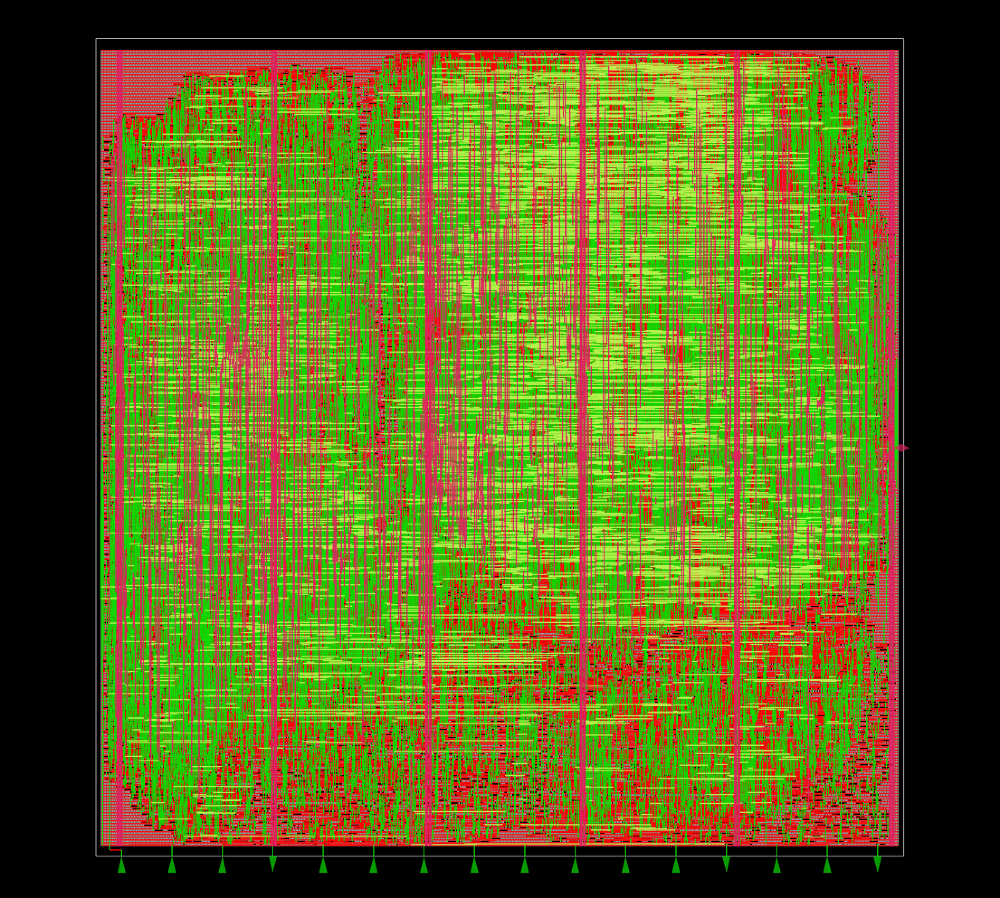

# HARTS: hardware real-time scheduler

Open-source RTL for a real-time scheduling coprocessor in SkyWater SKY130 high-density standard cells. The block implements configurable scheduling (priority, rate monotonic, earliest-deadline-first, and laxity-based modes), a 16-task task table, ready and sleep queues, a tick timer, and host interrupt signaling. A host talks to the scheduler over UART using a bridge that decodes serial frames into AMBA APB3 register accesses.

## Acknowledgments

Grateful to Dr. Mohamed Shalan for the foundational paper and ideas on configurable hardware scheduling for real-time systems, for his help throughout this work, and for the UART APB master :) that provides the host-facing serial bridge. Also, thankful for the ASIC-Hub team for the guidence provided throughout the sprint.
